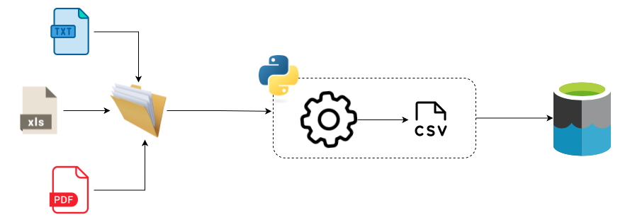

# Sobre o projeto:

Este projeto foi desenvolvido durante o meu estágio com o objetivo de automatizar um processo que exigia intervenção manual. Ele extrai informações de mais de 20 extratos provenientes de diferentes seguradoras, incluindo formatos como PDF, TXT, CSV e Excel, realiza a limpeza e transformação desses dados de acordo com a regra de cada seguradora, deixando-os prontos para serem carregados no datalake e, posteriormente, inseridos no banco de dados da empresa.

OBs: Esta é a estrutura do projeto após a refatoração. Não seguirei incluindo edições nesse código, por questões de segurança, não farei implementação com o objetivo de mantê-lo acessível e sem informações sensíveis.

## Estrutura do Projeto

O projeto está organizado da seguinte forma:

- `architecture/`: Contém as classes base e interfaces para a extração de dados, e funções.
- `extraction/`: Implementações específicas para cada seguradora.
- `rules/`: Regras e configurações para cada seguradora.
- `main.py`: Ponto de entrada principal do programa.

## Configuração do Ambiente

1. Clone o repositório:
   ```bash
   git clone <URL do repositório>
   cd <nome do repositório>
   ```

2. Instale as dependências usando Poetry:
   ```bash
   poetry install
   ```

3. Execute o projeto:
   ```bash
   poetry run python main.py
   ```

## Uso

1. Coloque os arquivos das seguradoras na pasta `files/`.
2. Adicione ou atualize as regras de extração de dados no arquivo `rules/regras.py`.
3. Implemente transformação ou atualize as classes de extração específicas para cada seguradora na pasta `extraction/`.
4. Execute o `main.py` para processar os arquivos e gerar os resultados.

O sistema extrairá automaticamente todos os dados dos arquivos na pasta e os salvará em um arquivo Excel consolidado.

## Adicionando Novas Seguradoras

Para adicionar suporte a uma nova seguradora:

1. Crie uma nova classe de extração em `extraction/` que herde de `EstrategiaExtracao`.
2. Implemente os métodos `extrair_texto` e `processar_dataframe` para a nova seguradora.
3. Adicione as regras e configurações da nova seguradora em `rules/regras.py`.
4. Atualize a lista de seguradoras em `main.py` para incluir a nova seguradora.

